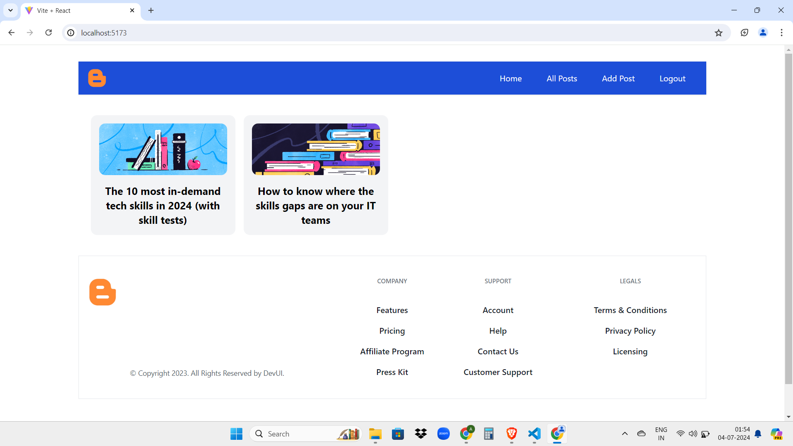

# MegaBlog

**A Modern Blogging Platform with React, Vite, and Appwrite**   

MegaBlog is a full-featured blogging website built with modern technologies, providing a seamless user experience for creating, managing, and sharing content.  

**Key Features:** 

**Authentication:** Secure signup and login functionalities using built-in authentication mechanisms. 
**Blog Creation:** Create engaging blog posts with the integrated TinyMCE rich text editor for a smooth writing experience. 
**Blog Management:** Edit and delete your own published blogs for easy revision and content control. 
**Content Discovery:** Explore a comprehensive collection of blogs published by all users on the platform.  

**Tech Stack:** 

**Frontend:** React 
**Build Tool:** Vite 
**Backend-as-a-Service (BaaS):** Appwrite 
**Editor**: TinyMCE  

**Getting Started** 

**1.Clone the Repository:** 

    git clone https://github.com/All300/MegaBlog.git   

**2.Install Dependencies:** 

    cd megablog

    npm install

**3.Configure Appwrite:** 
Create an Appwrite account at https://www.appwrite.io/. 
Follow Appwrite's documentation to set up your project and obtain the necessary environment variables (endpoint, project ID, etc.). 
Create a .env.local file at the root of the project and set these variables: 
    REACT_APP_APPWRITE_ENDPOINT=YOUR_APPWRITE_ENDPOINT
    REACT_APP_APPWRITE_PROJECT=YOUR_APPWRITE_PROJECT_ID
  

**4.Start the Development Server:** 

    npm run dev
  

**Usage** 

**Create an Account:** Sign up for a new account on the MegaBlog platform. 
**Login:** Sign in to your newly created account. 
**Create a Blog:** Navigate to the appropriate section to start composing a new blog post. 
**Write Your Content:** Utilize the TinyMCE editor to craft your engaging blog content. 
**Publish or Save:** Choose to publish your blog post or save it as a draft for later editing. 
**Manage Blogs:** Edit or delete your published blogs as needed. 
**Explore Content:** Discover and read blog posts created by other users on the platform.  

**Here is the output:** 

